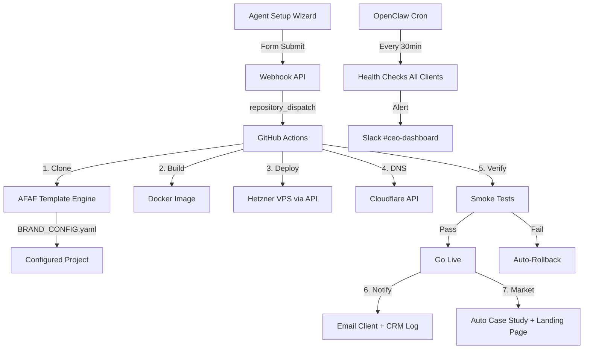

# 🤖 Project Clone & Distribution Research
## AfrexAI — Compiled Feb 26, 2026

---

## Existing Assets Discovered

**Monorepo:** `1kalin/afrex-os` — React/Express/Vite/Drizzle/PostgreSQL stack

**Projects in repo:**
- `afrex-ai-24-7-agents` — Python autonomous agents (puppeteer, browser automation)
- `afrex-ai-pia` — Full React+Vite SaaS app (PIA = AI analysis tool, heavily tested)
- `gusto` — React+Vite+Playwright app
- `zillow` — Project with docs
- `srs-self-recursive-skills` — Meta-skill system

**AFAF Framework (Already Built!):**
- `docs/afaf/afaf-any-os/` — Universal meta-templates for cloning ANY project
- `docs/afaf/afaf-verdict/` — Legal vertical (Verdict AI) with BRAND_CONFIG, terminology maps, rebrand manifests
- `docs/afaf/afaf-storylab/` — StoryLab variant with agent configs, brand configs
- `docs/afaf/afaf_receptionist/` — Receptionist AI variant
- Templates include: `BRAND_CONFIG.yaml`, `FIVE_ELEMENTS.yaml`, `CONFIG_TEMPLATE.yaml`, `INTEGRATION_HOOKS.yaml`

**Key Insight:** AFAF is 70% of the clone pipeline already. It has the rebrand engine, config schema, and domain adapters. What's missing is the **automation glue** — the CLI/workflow that runs `clone → configure → deploy → verify` without human intervention.

---

## Track 1: Template Engine & Scaffolding

### Key Findings
1. **AFAF already IS the template engine.** It has BRAND_CONFIG.yaml, terminology maps, and rebrand manifests. No need for Cookiecutter/Copier — you'd be rebuilding what exists.
2. **Copier** (Python) is the best fit IF you want a standalone CLI. It supports template updates (re-apply template changes to existing clones), which Cookiecutter can't do. Yeoman is dead. Nx generators are overkill for your monorepo size.
3. **GitHub Template Repos** work for one-shot clones but can't propagate upstream fixes. AFAF's approach (rebrand manifest + config-driven) is superior.
4. **Variable interpolation**: AFAF uses YAML configs → Claude Code applies them. This is actually better than Jinja2/Handlebars because the AI understands context, not just string replacement.
5. **Vercel/Shopify pattern**: They use JSON schema → form → generated config → deploy. Your Agent Setup Wizard already does step 1-2. Connect it to AFAF for 3-4.

### Recommended Stack
- **AFAF (existing)** — Your template engine. Enhance, don't replace.
- **Copier** (optional) — For non-AI scaffolding of boilerplate (env files, docker configs)
- **Claude Code + AFAF metaprompts** — For intelligent rebrand/clone operations

### Implementation Steps
1. Standardize BRAND_CONFIG.yaml across ALL projects (2h) — currently only Verdict/StoryLab/Receptionist have them
2. Create BRAND_CONFIG.yaml for VADIS, RapidShift, SiteVoice, KIN Living (4h)
3. Build `afaf-clone.sh` CLI wrapper: takes project name + client config → runs AFAF:rebrand (4h)
4. Test: clone Verdict → "Property AI for KIN Living" end-to-end (2h)

### Quick Wins
- Create BRAND_CONFIG.yaml for VADIS today (it's the most mature project)
- Add `afaf:clone` command to `.claude/commands/` in afrex-os

---

## Track 2: Infrastructure & Deployment Automation

### Key Findings
1. **You already have `deploy-customer.sh`** (Hetzner CX31 via API) in aaas-operations. Extend it, don't rebuild.
2. **Docker Compose per client** is the right call at your scale. Kubernetes is overkill for <50 clients. Each client gets: app container + postgres + nginx reverse proxy.
3. **Hetzner API + Cloudflare API** is the cheapest viable stack: ~€8/mo per client VPS + free DNS/SSL via Cloudflare.
4. **Database**: Dedicated per client (not shared). At $8/mo per VPS, isolation is cheap and eliminates multi-tenancy bugs entirely.
5. **GitHub Actions** can trigger on: webhook from Agent Setup Wizard → clone repo → apply AFAF config → build Docker image → deploy to Hetzner → configure Cloudflare DNS → smoke test.

### Recommended Stack
- **Hetzner Cloud API** — VPS provisioning ($8/mo CX31)
- **Docker Compose** — Per-client container orchestration
- **Cloudflare API** — DNS + SSL automation (free plan)
- **GitHub Actions** — CI/CD pipeline
- **1Password** — Secrets management (already using)

### Implementation Steps
1. Templatize `deploy-customer.sh` to accept BRAND_CONFIG.yaml as input (3h)
2. Create `docker-compose.template.yml` with variable substitution for each project type (4h)
3. Cloudflare DNS automation script: create A record + SSL for `{client}.afrexai.com` (2h)
4. GitHub Actions workflow: `.github/workflows/deploy-client.yml` triggered by repository_dispatch (4h)
5. Smoke test script: hit health endpoint + verify branding (2h)

### Quick Wins
- Templatize the existing deploy-customer.sh to read from BRAND_CONFIG.yaml
- Create a Cloudflare API script for DNS automation

---

## Track 3: White-Label Configuration Architecture

### Key Findings
1. **AFAF's Five Elements pattern** already defines the multi-tenancy architecture: Data Layer, Processing, Acceptance, Progress Tracking, Integration Hooks.
2. **Feature flags**: Don't need LaunchDarkly. A simple `features.json` per client works: `{"voice_ai": true, "crm_integration": false, "email_automation": true}`. Claude reads it at deploy time.
3. **Theme/brand config** is solved: BRAND_CONFIG.yaml handles colors, logos, terminology, env prefixes, DB prefixes. Already proven with Verdict → Property AI conversion.
4. **Plugin architecture**: Each AFAF variant already has MODULE_REGISTRY.json and INTEGRATION_HOOKS.yaml. Clients can have custom modules without forking.
5. **Config-driven UI**: The PIA project already uses Vite+React with configurable components. Extend with a `theme.json` that maps to Tailwind CSS variables.

### Recommended Stack
- **AFAF Five Elements** — Existing architecture pattern
- **BRAND_CONFIG.yaml** — Single source of truth for all client customization
- **features.json** — Simple feature flags per deployment
- **Tailwind CSS variables** — Theme-driven UI from config

### Implementation Steps
1. Create unified `client-config-schema.json` (JSON Schema) that validates all BRAND_CONFIG.yaml files (3h)
2. Build Tailwind theme generator: reads BRAND_CONFIG.yaml → outputs `tailwind.config.js` overrides (2h)
3. Add features.json template with all toggleable features documented (2h)
4. Create MODULE_REGISTRY for each existing project (4h for all 4 projects)

### Quick Wins
- Document all current feature toggles across projects into one features.json template
- Create the JSON Schema for BRAND_CONFIG.yaml validation

---

## Track 4: Marketing & Distribution Automation

### Key Findings
1. **You already have 22+ pages on GitHub Pages**, case studies (VADIS $1.6M, SiteVoice $52K), YouTube videos, and a context packs storefront. The content factory is running.
2. **Programmatic landing pages**: Each clone should auto-generate a case study page. Template: swap industry, client name, metrics. Your existing case study pages are already templated.
3. **AI case studies**: When a client clone deploys, automatically generate a case study from the BRAND_CONFIG (industry, use case, projected ROI). Post to blog.
4. **Video demos**: HeyGen/Synthesia for per-vertical demo videos costs ~$30/video. Christina's YouTube channel can host. Batch 5 vertical demos for $150.
5. **Email sequences**: You have 15 email templates across 3 steps. Parameterize them with BRAND_CONFIG variables for per-client onboarding drips.

### Recommended Stack
- **GitHub Pages + Jekyll** — Existing (programmatic pages per vertical)
- **Claude** — Generate case studies from BRAND_CONFIG + deploy data
- **HeyGen** — Per-vertical video demos ($30 each)
- **Existing email templates** — Parameterize with BRAND_CONFIG

### Implementation Steps
1. Create `generate-case-study.sh`: reads BRAND_CONFIG.yaml → outputs markdown case study → commits to blog (3h)
2. Create landing page template: `verticals/{industry}/index.html` auto-generated from config (4h)
3. Parameterize all 15 email templates to accept BRAND_CONFIG variables (3h)
4. Record 3 vertical video demos with HeyGen: Legal, Construction, Financial (1 day)
5. SEO: programmatic `/{industry}-ai-agents` pages for top 10 verticals (4h)

### Quick Wins
- Generate 3 case study pages from existing client data (VADIS, RapidShift, StoryLab)
- Create `/verticals/` directory with template

---

## Track 5: Workflow Orchestration & Meta-Workflows

### Key Findings
1. **OpenClaw + cron jobs** is your orchestration layer. You already run 43 cron jobs and 9 agents. Don't add n8n/Temporal — it's another system to maintain.
2. **The meta-workflow is**: Agent Setup Wizard form → webhook → GitHub Actions → AFAF clone → deploy-customer.sh → Cloudflare DNS → smoke test → auto-email → CRM log → case study generation.
3. **Quality gates**: Add 3 checkpoints: (1) BRAND_CONFIG validation, (2) build passes, (3) smoke test passes. Auto-rollback if any fail.
4. **Monitoring**: Each client VPS gets a simple health endpoint. OpenClaw cron checks all endpoints every 30 min (batch in heartbeat).
5. **Event-driven**: GitHub Actions `repository_dispatch` is the trigger. Agent Setup Wizard POST → API endpoint → fires dispatch → pipeline runs.

### Recommended Stack
- **OpenClaw crons** — Monitoring + periodic tasks (existing)
- **GitHub Actions** — CI/CD pipeline (existing)
- **Webhook endpoint** — Connect Agent Setup Wizard to pipeline
- **deploy-customer.sh** — Provisioning (existing, extend)

### Implementation Steps
1. Create GitHub Actions workflow: `deploy-client.yml` with full pipeline (6h)
2. Add webhook endpoint to Agent Setup Wizard: POST → fires repository_dispatch (3h)
3. Build health-check aggregator: cron pings all client endpoints, alerts on failure (3h)
4. Add auto-rollback: if smoke test fails, destroy VPS + alert Kalin (2h)
5. CRM auto-log: on successful deploy, update CRM with client status (2h)

### Quick Wins
- Wire Agent Setup Wizard form to a simple webhook that logs to CRM
- Create the GitHub Actions workflow skeleton

---

## Priority Matrix

| Action | Impact | Effort | Priority |
|--------|--------|--------|----------|
| Standardize BRAND_CONFIG across all projects | 🔴 High | 4h | **P0 — Do first** |
| Build `afaf-clone.sh` CLI wrapper | 🔴 High | 4h | **P0** |
| Templatize deploy-customer.sh | 🔴 High | 3h | **P0** |
| GitHub Actions deploy pipeline | 🔴 High | 6h | **P1** |
| Cloudflare DNS automation | 🟡 Med | 2h | **P1** |
| Docker Compose templates | 🟡 Med | 4h | **P1** |
| Case study auto-generation | 🟡 Med | 3h | **P2** |
| Agent Setup Wizard → webhook | 🟡 Med | 3h | **P2** |
| Health-check aggregator | 🟢 Low | 3h | **P3** |
| HeyGen video demos | 🟢 Low | 1 day | **P3** |

## Architecture (Mermaid)

## 90-Day Roadmap

**Week 1-2 (Now → Mar 7):**
- P0: Standardize BRAND_CONFIG across VADIS, SiteVoice, RapidShift, KIN
- P0: Build afaf-clone.sh CLI
- P0: Templatize deploy-customer.sh
- Test: Clone VADIS → new client instance end-to-end

**Week 3-4 (Mar 7-21):**
- P1: GitHub Actions deploy pipeline
- P1: Docker Compose templates
- P1: Cloudflare DNS automation
- CONEXPO prep: Have live demo of clone → deploy in <10 minutes

**Week 5-8 (Mar 21 → Apr 18):**
- P2: Auto case study generation
- P2: Webhook from Agent Setup Wizard
- P2: Programmatic landing pages per vertical
- Target: 3 client clones deployed

**Week 9-12 (Apr 18 → May 16):**
- P3: Health monitoring aggregator
- P3: Video demos per vertical
- Scale: Pipeline handles 10+ concurrent clients
- Target: 8 client deployments

## Cost Estimate Per Client Instance

| Item | Monthly Cost |
|------|-------------|
| Hetzner CX31 VPS | ~$8 |
| Cloudflare (free plan) | $0 |
| Domain (if custom) | ~$1 (amortized) |
| Monitoring (OpenClaw cron) | $0 (existing) |
| **Total per client** | **~$9/mo** |
| **Charging client** | **$1,500/mo** |
| **Margin** | **99.4%** |

---

*Research compiled by Kael — AfrexAI Build Engine*
*Sources: 1kalin/afrex-os monorepo, afrexai-cto GitHub, existing AFAF documentation*
